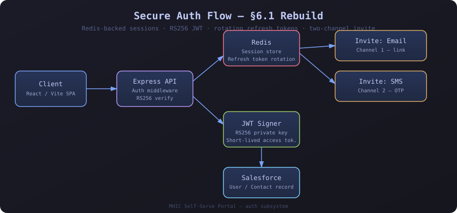
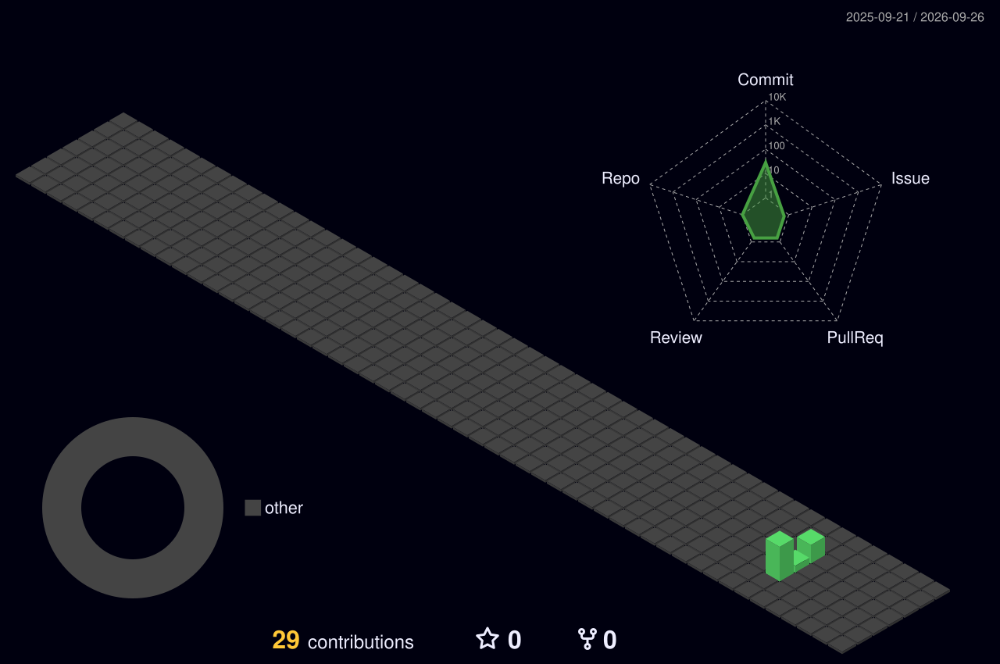

<!--
  GITHUB PROFILE README
-->

<h1 align="center">
  
</h1>

  

  
  

---

### 🧭 About Me

- 🛠️ IT Systems Administrator working across **Salesforce**, **Microsoft 365 / Entra ID / Intune**, **network security**, and **full-stack web development**
- 🎓 B.S. in Information Science, University of Maryland (2025)
- 🔐 Focused on secure authentication design (JWT, OAuth, RBAC), DLP, and infrastructure hardening
- 🤖 Currently building LLM-powered automation pipelines integrated with Salesforce
- 🌱 Always exploring new tools in automation, AI tooling, and cloud security
- 💬 Ask me about Salesforce Flows, Entra ID/Intune, or React/Node.js apps

---

### 🧰 Tech Stack

  

  
  
  

---

### 📊 GitHub Stats

  
  

  

---

### 🏗️ System Design — Auth Rebuild

  

<i>A secure session/token flow I designed and shipped: Redis-backed sessions, RS256-signed JWTs, rotating refresh tokens, and a two-channel (email + SMS) invite system.</i>

---

### 🧊 3D Contribution Graph

  

---

### 🐍 Contribution Snake

  

> ⚠️ The snake graph needs a small GitHub Action to generate it — see `snake.yml` below, drop it into `.github/workflows/` in your profile repo.

---

  

